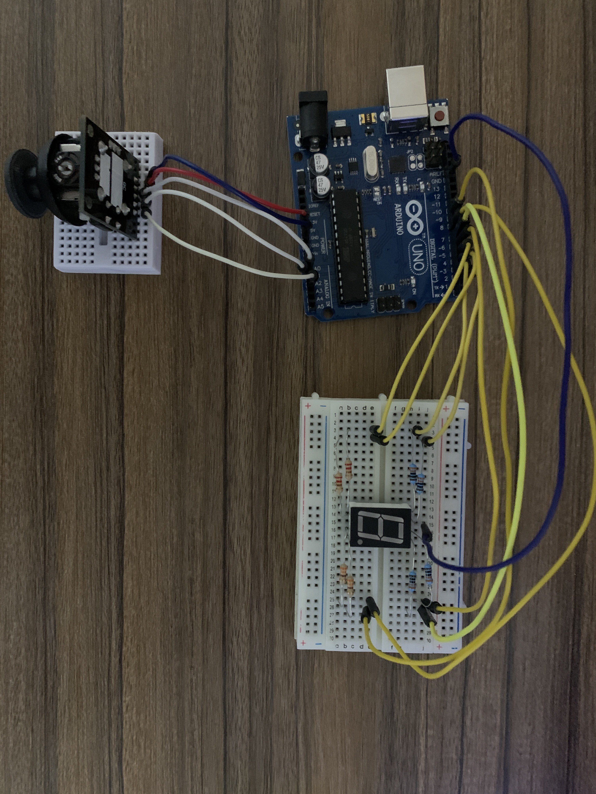
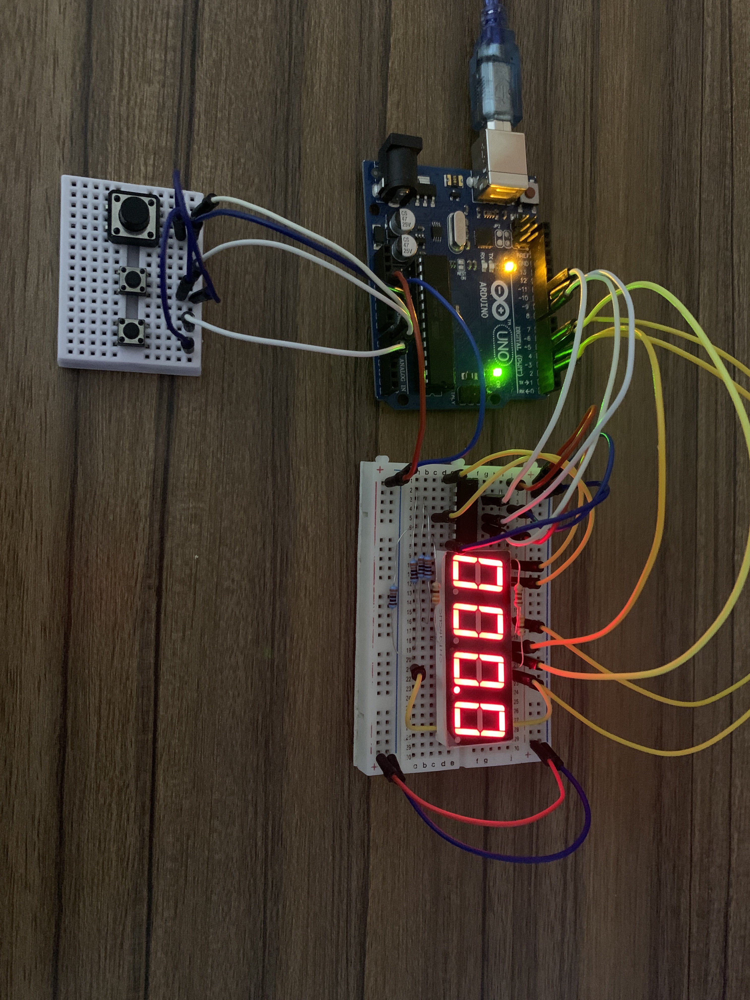

# Introduction to Robotics (2023 - 2024)

Explore my collection of robotics laboratory homework assignments from my third year at the Faculty of Mathematics and Computer Science, University of Bucharest. Each homework package contains detailed requirements, implementation instructions, as well as code and image files for your reference.

# Homework 2

For this assignment, the task is to control each of the three colors of the LED by dedicating one potentiometer to each color. It's crucial to establish a mapping that translates the values generated by the potentiometers into the specific input values required to control the LED.

You can check out the code [here](https://github.com/0xfabian/IntroductionToRobotics/blob/main/hw2/rgb_led.ino).

[Click here to see the video!](https://youtu.be/uM623n7TpGw?si=PpcFdsfTmM-2AtKX)

# Homework 3

This assignment involves creating a 3-floor elevator control system with LEDs, buttons, and a buzzer using Arduino. The system uses LEDs to indicate the current floor and elevator's operational state, buttons to call the elevator, and a buzzer for sound cues during various scenarios. It also includes logic to handle button presses and debounce to prevent unintended repeats.

You can check out the code [here](https://github.com/0xfabian/IntroductionToRobotics/blob/main/hw3/elevator.ino).

[Click here to see the video!](https://youtu.be/xLKiXhK3EQ0?si=b9KJfdZwEA7YkYuc)

# Homework 4

This assignment involves creating a comprehensive project where a joystick is utilized to manipulate the position and state of a 7-segment display, allowing for seamless transitions between segments, toggling their states via button presses, and incorporating a reset functionality to clear the display and return to the initial position.

You can check out the code [here](https://github.com/0xfabian/IntroductionToRobotics/blob/main/hw4/7seg.ino).

[Click here to see the video!](https://youtu.be/YJ4ITtAef10?si=XfXXjvnb1Jqge23t)

# Homework 5

For this assignment, the task is to create a stopwatch timer using a 4-digit 7-segment display and three buttons. The stopwatch should count in 10ths of a second and include a lap-saving functionality similar to basic stopwatch functions on phones. The components required are a 7-segment display, three buttons, resistors, and wires. The initial display value should be "000.0", and the buttons should function as follows: Button 1 for start/pause, Button 2 for reset (when in pause mode) or reset saved laps (when in lap viewing mode), and Button 3 for saving laps (when in counting mode) and cycling through the last four saved laps.

You can check out the code [here](https://github.com/0xfabian/IntroductionToRobotics/blob/main/hw5/stopwatch.ino).

[Click here to see the video!](https://youtu.be/bcCKNkfMjKg?si=WSM4FGU8qV_DCaId)

# Homework 6

This assignment involves the creation of a "Smart Environment Monitor and Logger" using Arduino, which integrates various sensors to collect environmental data, logs this data into EEPROM, and provides visual feedback through an RGB LED, along with user interaction via a Serial Menu. The project entails submenus for configuring sensor settings, setting alert thresholds for the ultrasonic sensor and LDR, resetting logger data, checking system status, and controlling the RGB LED with manual color selection and automatic mode toggling. Emphasis should be placed on efficient EEPROM utilization, ensuring sensor calibration for accurate readings, and implementing error handling for Serial Communication.

You can check out the code [here](https://github.com/0xfabian/IntroductionToRobotics/blob/main/hw6/seml.ino).

[Click here to see the video!](https://youtu.be/qQH7hyZsMkA?si=_5umL6UUSU2JAlbs)
