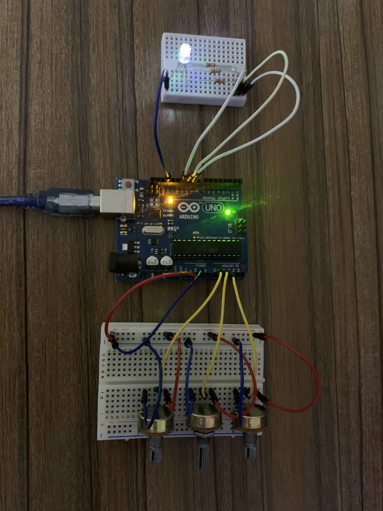
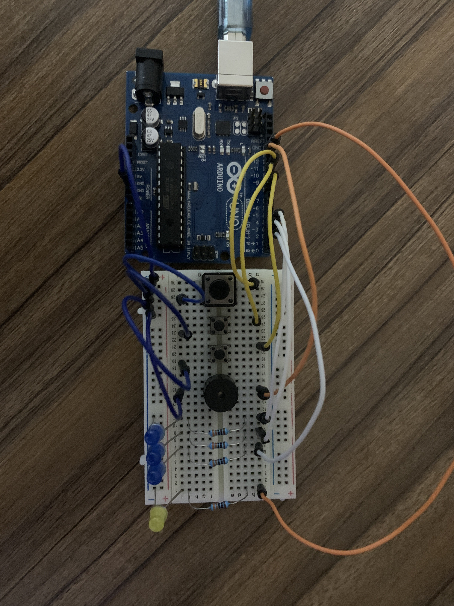

# Introduction to Robotics (2023 - 2024)

Explore my collection of robotics laboratory homework assignments from my third year at the Faculty of Mathematics and Computer Science, University of Bucharest. Each homework package contains detailed requirements, implementation instructions, as well as code and image files for your reference.

# Homework 2

For this assignment, the task is to control each of the three colors of the LED by dedicating one potentiometer to each color. It's crucial to establish a mapping that translates the values generated by the potentiometers into the specific input values required to control the LED.

You can check out the code [here](https://github.com/0xfabian/IntroductionToRobotics/blob/main/hw2/rgb_led.ino).

[Click here to see the video!](https://youtu.be/uM623n7TpGw?si=PpcFdsfTmM-2AtKX)

# Homework 3

This assignment involves creating a 3-floor elevator control system with LEDs, buttons, and a buzzer using Arduino. The system uses LEDs to indicate the current floor and elevator's operational state, buttons to call the elevator, and a buzzer for sound cues during various scenarios. It also includes logic to handle button presses and debounce to prevent unintended repeats.

You can check out the code [here](https://github.com/0xfabian/IntroductionToRobotics/blob/main/hw3/elevator.ino).

[Click here to see the video!](https://youtu.be/xLKiXhK3EQ0?si=b9KJfdZwEA7YkYuc)
